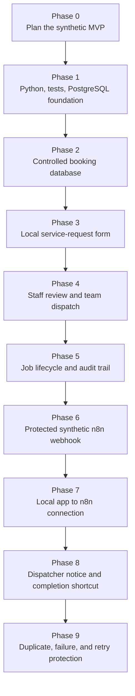

# Phases 0–9 Roadmap

## Completed outcomes

| Phase | Outcome |
| --- | --- |
| 0 | Defined a bounded synthetic-only MVP. |
| 1 | Created local Python, Pytest, and PostgreSQL foundation. |
| 2 | Added controlled relational booking schema. |
| 3 | Built local request form and receipt. |
| 4 | Added staff approval and two-team scheduling. |
| 5 | Added job lifecycle, history, cancellation, and completion shortcut. |
| 6 | Built protected unpublished n8n synthetic webhook workflow. |
| 7 | Connected local synthetic outbox to n8n test webhook. |
| 8 | Stored/displayed dispatcher notice after completed jobs. |
| 9 | Added duplicate prevention, visible failed delivery, and retry evidence. |
